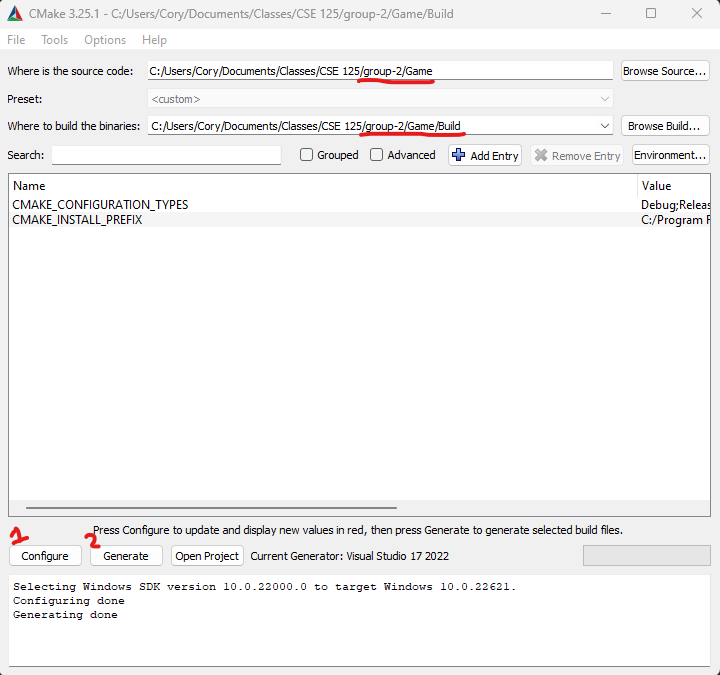
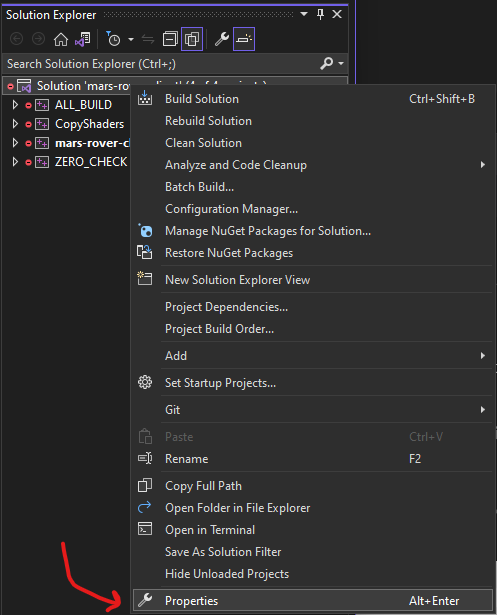
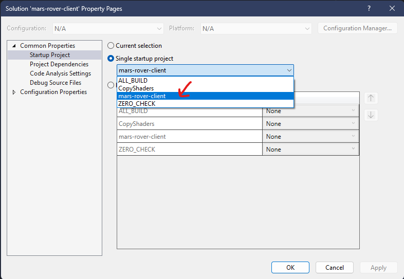

# group2
## How to build solution using CMake
First download CMake and launch the program.
Set the source code to the Game directory and build the binaries in a folder called "Build"

Click Configure and set the Visual Studios version to **"Visual Studios 17 2022"**

Click Generate

Then navigate to the Build folder and click on the solution file to open the project in Visual Studios

Once in Visual Studios there's only one thing left to do, right-click on the Solution in the Solution explorer -> go to properities

Then select "mars-rover-client" as the startup project

You should be all setup and be able to compile the project now!